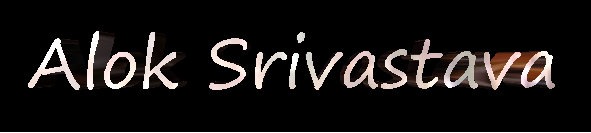

<!-- markdownlint-enable MD033 -->

<!-- markdownlint-disable MD033 -->

<!-- markdownlint-enable MD033 -->

📢 Nominate ([@Alok Srivastava](https://coolaries26.github.io)) as **[GitHub Star](https://stars.github.com/nominate)**. If you appreciate his hardwork and dedication.

<!-- markdownlint-disable MD033 -->

<!-- markdownlint-enable MD033 -->

<!-- markdownlint-disable MD033 -->

<h4 style="font-family: courier"> DBMS Expert, System Administrator, Cloud administrator & DevOps Engineer from<b> INDIA.</b></h2>

<!-- markdownlint-enable MD033 -->

- ☕ In the world of Tea lovers I am a Coffee lover 😋
- 👀 I’m interested in system administration and managing the applications
- 🎯 Wasting my time to save other people's time.
- 💞️ I’m looking to collaborate on full backend support either onprem, cloud and hybrid.
- 💡 [Learn more about me](https://coolaries26.github.io).
- 📫 How to reach me ... kashyapalok@yahoo.com 
- 😄 Pronouns: ... **He**

## 🔧 Technologies

    
&#9889 <b>GitHub Stats</b>
 

---

By [Alok Srivastava](https://coolaries26.github.io/coolaries26) 🙏

---------------------------------------------------------------------------------------------------------

<!---
coolaries26/coolaries26 is a ✨ special ✨ repository because its `README.md` (this file) appears on your GitHub profile.
You can click the Preview link to take a look at your changes.
--->
